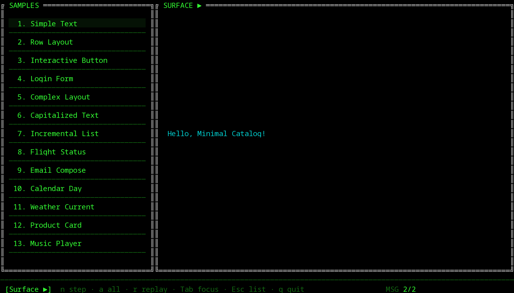
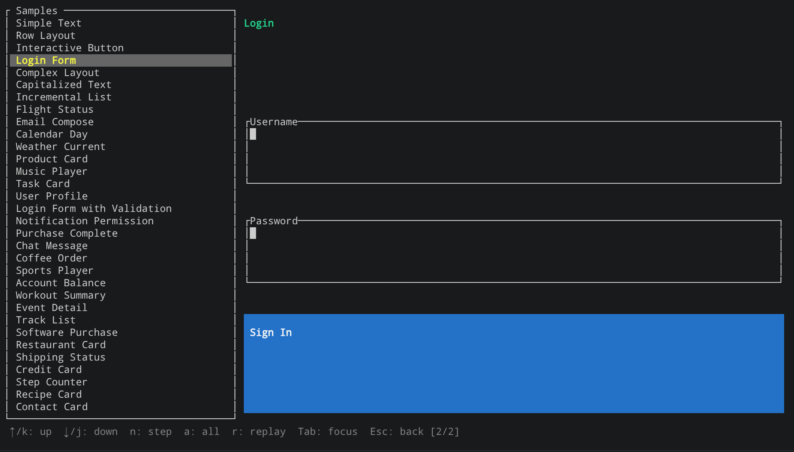
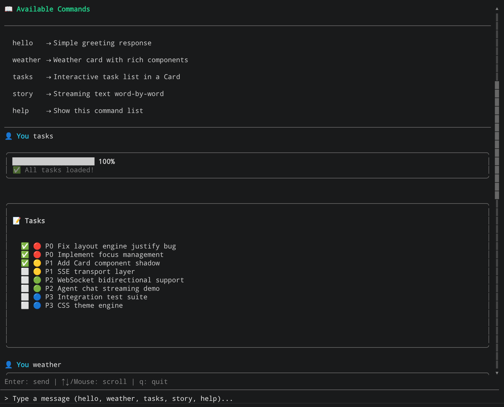
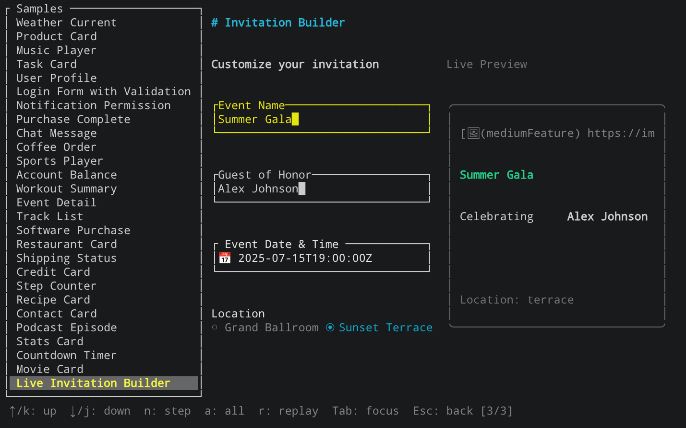
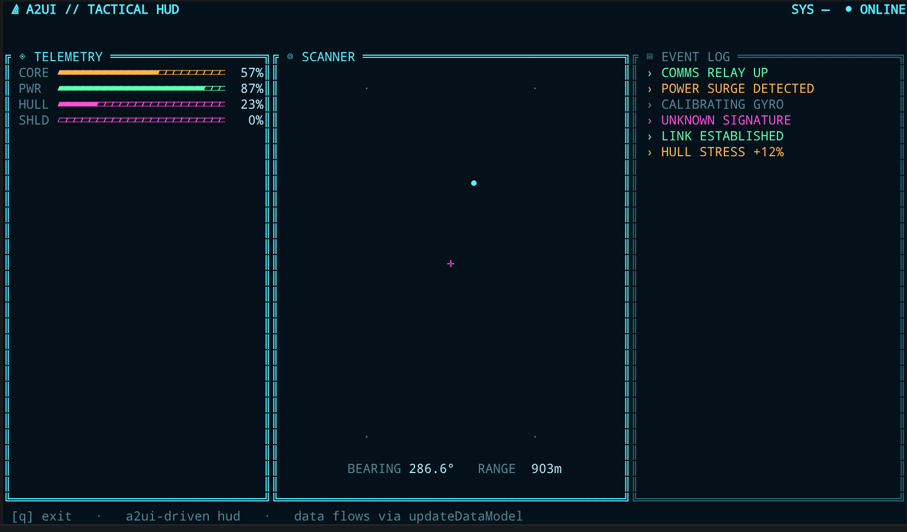
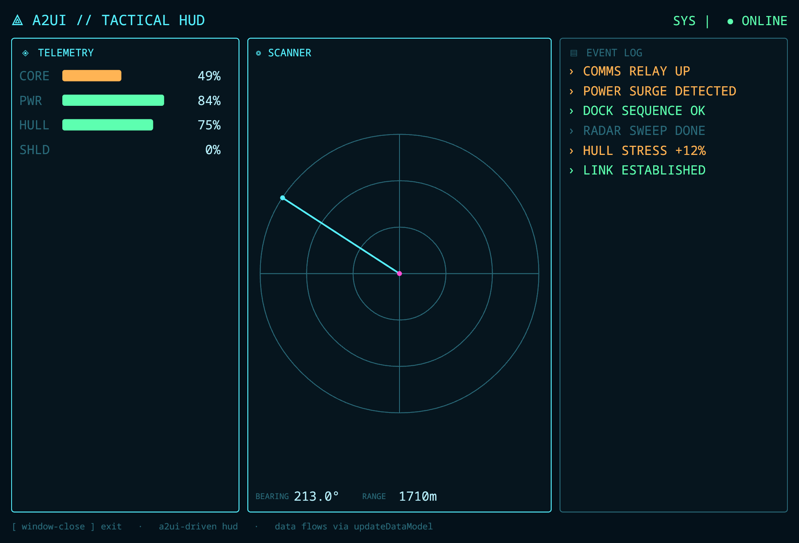
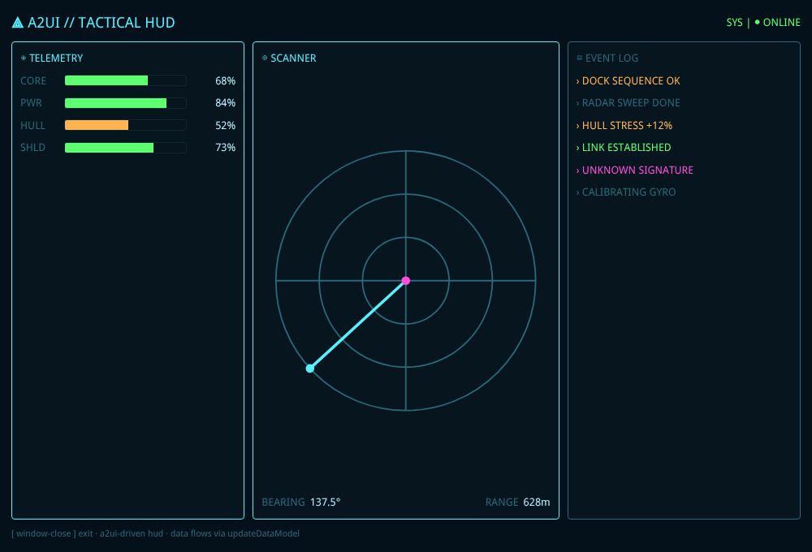

# A2UI — Rust impl of the A2UI protocol (ratatui terminal + Slint / egui / Bevy / Iced / Dioxus desktop)

[](https://crates.io/crates/a2ui)
[](https://docs.rs/a2ui)
[](LICENSE)

English | [中文](README.md)

A Rust implementation of the [A2UI (Agent to UI) v1.0](https://github.com/a2ui-project/a2ui) protocol — a JSON-based streaming UI protocol that lets AI Agents dynamically generate and update interfaces.

On top of a single framework-agnostic core (`a2ui-base`), it ships **6 rendering backends**: the default terminal backend `a2ui-tui` (built on [ratatui](https://ratatui.rs/)), plus five **optional** native-desktop backends — [Slint](https://slint.dev/), [egui](https://github.com/emilk/egui), [Bevy](https://bevyengine.org), [Iced](https://github.com/iced-rs/iced), and [Dioxus](https://github.com/DioxusLabs/dioxus). See the [Backend Support Matrix](#backend-support-matrix) for each backend's rendering fidelity and real-input capability.

The project is organized as a Cargo workspace: `a2ui-base` (framework-agnostic core) + 6 backends (`a2ui-tui` / `a2ui-slint` / `a2ui-egui` / `a2ui-bevy` / `a2ui-iced` / `a2ui-dioxus`) + a matching `*-gallery` demo app for each + `a2ui` (an umbrella that re-exports them, keeping `use a2ui::core::...` / `use a2ui::tui::...` paths working).

## Features

- ✅ Full A2UI v1.0 protocol support
- ✅ **18 TUI components**: Text, Row, Column, Button, TextField, Card, Divider, List, CheckBox, Icon, Tabs, Modal, Slider, ChoicePicker, DateTimeInput, Image, Video, AudioPlayer
  - Interactive: Text, Row, Column, Button, TextField, Slider, CheckBox, ChoicePicker, DateTimeInput (arrow keys adjust the value)
  - Placeholders (default): Image / Video / AudioPlayer render only text placeholders (`[🖼 description]`, `[▶ url]`, `[♫ url]`) — the terminal cannot decode pixels/audio/video. Enable real image/audio rendering via the Optional Features below.
- ✅ **Capabilities negotiation**: `ClientCapabilities` / `ServerCapabilities` types + a builder that derives `supportedCatalogIds` from registered catalogs.
- ✅ **Inline catalogs**: the server can declare `acceptsInlineCatalogs`; the client parses and validates inline catalog JSON (UAX#31 identifier checks) and registers schema-only functions at runtime.
- ✅ **Generic fallback renderer**: unknown / inline-custom component types render as a visible labeled box (type + properties + children) instead of a bare "unknown" error.
- ✅ **14 client-side functions**: required, regex, length, numeric, email, and/or/not, formatString, formatNumber, formatCurrency, formatDate, pluralize, openUrl
- ✅ **Payload validation**: integrity / topology / recursion & path checks plus a fault-tolerant `parse_and_fix` (auto-heals malformed JSON like smart quotes and trailing commas), ported from the Python SDK. Opt-in on `MessageProcessor` (`with_validation(cfg)` + `drain_validation()`), OFF by default and never blocks component loading — for untrusted or LLM-generated payloads.
- ✅ **Modular Cargo workspace architecture** (`a2ui-base` framework-agnostic / `a2ui-tui` ratatui backend / `a2ui-gallery` demo app / `a2ui` umbrella)
- ✅ JSON Pointer data binding with reactive state management
- ✅ Gallery App sample browser with progressive message rendering
- ✅ **231 unit/integration tests** (core 127 + tui 61 + gallery e2e 21 + slint 10 + iced 12), including end-to-end tests with A2UI specification examples

## Screenshots

**Gallery Sample Browser**



**Login Form**



**Agent Chat** (AI chat interface, `08_agent_chat` example: multi-surface chat layout, streaming A2UI messages, rich components like Card / Column / Row / Divider)



**Invitation Builder** (spec sample `30_live-invitation-builder`: a reactive form layout where TextField / Slider / ChoicePicker / DateTimeInput components work together to preview an invitation in real time)



**Sci-fi HUD — backend comparison** (same data, same `updateDataModel` protocol, different renderer; every live value — gauges, radar sweep, event log — is read from the a2ui data model)

| ratatui terminal (`17_scifi_hud` in `a2ui`) | Iced desktop (`17_scifi_hud` in `a2ui-iced`) | Dioxus desktop (`17_scifi_hud` in `a2ui-dioxus`) |
|:---:|:---:|:---:|
|  |  |  |

The ratatui version uses custom `TuiComponent`s to draw ASCII gauges and a character-grid radar; the Iced version uses `progress_bar` gauges and a `Canvas`-drawn radar; the Dioxus version uses CSS-bar gauges and an **SVG** radar sweep, rendered into a system WebView. The architecture is identical — only **data** flows through the protocol; the rendering layer is each backend's own.

> The sci-fi HUD is currently realized for the **ratatui (TUI)**, **Iced**, and **Dioxus** backends; the Slint / egui / Bevy galleries render the standard spec samples and do not yet have a HUD variant.

## Quick Start

```bash
# Run the Gallery App
cargo run -p a2ui-gallery

# Install the Gallery App (provides the `a2ui_gallery` binary)
cargo install a2ui-gallery

# Run an example (lives in the umbrella crate)
cargo run -p a2ui --example 12_handshake
```

### Controls

| Key | Action |
|-----|--------|
| `↑`/`k`, `↓`/`j` | Navigate sample list |
| `Enter` | Select and render current sample |
| `n` | Step through next message |
| `a` | Process all remaining messages |
| `r` | Reset and replay |
| `Tab` | Cycle focus |
| `Esc` | Back to list / Quit |

## Architecture

```
┌──────────────────────────────────────────────────────────────┐
│  apps:       a2ui-gallery (TUI)   a2ui-{slint,egui,bevy,iced,dioxus}-gallery (desktop)
├──────────────────────────────────────────────────────────────┤
│  umbrella:   a2ui  (re-export core + tui [+ slint] [+ egui] [+ bevy] [+ iced] [+ dioxus])
├──────────────────────────────────────────────────────────────┤
│  backends:   a2ui-tui (ratatui)   a2ui-slint (Slint, opt-in)   a2ui-egui (egui, opt-in)   a2ui-bevy (Bevy, opt-in)   a2ui-iced (Iced, opt-in)   a2ui-dioxus (Dioxus, opt-in)
├──────────────────────────────────────────────────────────────┤
│  a2ui-base (framework-agnostic: Protocol / Model / Catalog / Processor)
└──────────────────────────────────────────────────────────────┘
```

Dependencies flow upward: `a2ui-base` underpins six backends — `a2ui-tui` (ratatui, default), `a2ui-slint` (Slint desktop, optional), `a2ui-egui` (egui desktop, optional), `a2ui-bevy` (Bevy ECS UI desktop, optional), `a2ui-iced` (Iced desktop, optional), and `a2ui-dioxus` (Dioxus WebView desktop, optional). Each backend has a matching `*-gallery` app; the `a2ui` umbrella depends on core + tui (slint / egui / bevy / iced / dioxus each behind a same-named feature). `a2ui-base` has zero ratatui/slint/egui/bevy/iced/dioxus dependency and can be used standalone by other backends.

## Backend Support Matrix

All five backends share the same `a2ui-base` core (interaction logic / `dispatch_event` / `apply_event_result`), but rendering fidelity and "real input" capability vary by GUI framework:

> ✅ Full (rendered; interactive controls accept input) · 🟡 Best-effort (read-only / limited interaction) · ⬜ Placeholder

| Component | TUI (ratatui) | Slint | egui | Bevy | Iced | Dioxus |
|-----------|:---:|:---:|:---:|:---:|:---:|:---:|
| Text / Row / Column / Card / List / Divider | ✅ | ✅ | ✅ | ✅ | ✅ | ✅ |
| Button | ✅ | ✅ | ✅ | ✅ | ✅ | ✅ |
| Modal | ✅ | ✅ | ✅ | ✅ | ✅ | ✅ |
| TextField | ✅ | 🟡 | ✅ | ✅ | ✅ | ✅ |
| CheckBox | ✅ | ✅ | ✅ | ✅ | ✅ | ✅ |
| Slider | ✅ | 🟡 | ✅ | ✅ | ✅ | ✅ |
| ChoicePicker | ✅ | 🟡 | ✅ | ⬜ | ✅ | ✅ |
| Tabs | ✅ | 🟡 | 🟡 | 🟡 | ✅ | ✅ |
| DateTimeInput | ✅ | 🟡 | 🟡 | 🟡 | ✅ | ✅ |
| Icon | ✅ | 🟡 | 🟡 | 🟡 | ✅ | ✅ |
| Image | ✅² | ⬜ | ⬜ | ⬜ | ✅⁵ | ✅³ |
| Video | ⬜ | ⬜ | ⬜ | ⬜ | ⬜ | ✅⁴ |
| AudioPlayer | ✅¹ | ⬜ | ⬜ | ⬜ | ⬜ | ✅⁴ |

¹ Needs the `audio` feature.
² The TUI backend decodes and renders actual image pixels via `ratatui-image` (kitty / iTerm2 / Sixel / Halfblocks auto-degrade, local paths only); the Slint / egui / Bevy desktop backends currently render only a text placeholder.
³ The Dioxus backend renders images via the native WebView `` (supports `file://` / `http(s)` / `data:` URLs).
⁴ The Dioxus backend plays real media via the native WebView `<audio>` / `<video>` elements (the browser supplies full transport controls — play/pause/seek/volume/fullscreen) — something the terminal and other desktop backends cannot do.
⁵ Iced has no built-in URL image loader (its `image` widget only takes a local path or in-memory bytes), so an `Image`'s `http(s)` URL is fetched out-of-band with `ureq`, decoded via `Handle::from_bytes`, and cached (cleared on sample switch); local paths go straight through `Handle::from_path`. `fit` maps onto `ContentFit`.

- **The TUI backend is the reference implementation** — all 18 components render fully; real images are on by default (`ratatui-image`), audio needs the `audio` feature, video is always a placeholder.
- **Genuine input on the interactive widgets (TextField / Slider / CheckBox / ChoicePicker / DateTimeInput)**: full on egui, Bevy, Iced, Dioxus, and TUI. **On Slint only Button / CheckBox clicks are wired** — TextField and Slider render read-only.
- **Bevy's ChoicePicker** is currently a text label (`[ChoicePicker: …]`); not yet wired to a native picker.
- **Iced is the cleanest-mapping backend** (no state bridge, no diffing); all five interactive widgets are native — ChoicePicker uses a native `pick_list` (single-select) / checkbox group (multi-select), DateTimeInput is an editable text box bound to the data model, and Tabs has a clickable tab bar (a bound `activeTab` writes back to the data model; the gallery samples leave it unbound, so the selected tab is tracked locally and clicks still switch panels); Icon renders an emoji (the mapping matches the TUI); **and Image renders for real** (local paths decoded inline, remote URLs fetched + cached in the background, see footnote ⁵). **Dioxus is the most architecturally distinct** (reactive signals + WebView/CSS rendering), and thanks to the WebView, Image / Video / AudioPlayer render via native HTML media elements too — **it is the only backend to cover all 18 A2UI components** (even the TUI's Video is a placeholder, since a terminal cannot play video).

## Slint Desktop Backend

Alongside the ratatui terminal backend, the project ships **`a2ui-slint`**, which renders A2UI component trees into a **native desktop window** (built on [Slint](https://slint.dev/), pinned to 1.16). The framework-agnostic interaction logic (focus traversal, event dispatch, `EventResult` application) is shared in `a2ui-base`, so both backends behave identically for keyboard / button interactions.

**It is opt-in and heavy**: `a2ui-slint` is a **non-default workspace member** (it pulls the Slint toolchain + GUI system libraries). A plain `cargo build` only compiles the ratatui stack. Build the Slint backend explicitly:

```bash
cargo build -p a2ui-slint --features backend
```

The umbrella crate also re-exports it as `a2ui::slint` behind a `slint` cargo feature.

### Running the Gallery (desktop)

`a2ui-slint-gallery` loads the same embedded A2UI samples as the ratatui gallery, in a window. It prints the full numbered sample list at startup:

```bash
cargo run -p a2ui-slint-gallery             # first sample
cargo run -p a2ui-slint-gallery -- 3        # by 1-based index
cargo run -p a2ui-slint-gallery -- login    # by case-insensitive name substring
```

Renderer: `renderer-software` + `backend-winit` — it works **without a GPU / OpenGL driver**.

### Component coverage

All 18 A2UI component kinds render:

- **Rich**: Text / Button / Column / Row / Card / TextField / CheckBox / Slider (Button & CheckBox clicks dispatch through the shared `core::components::dispatch_event`)
- **Best-effort**: Divider / Icon / Tabs / Modal / List / ChoicePicker / DateTimeInput
- **Placeholders**: Image / Video / AudioPlayer render as labeled placeholders (binary media isn't carried into the Slint tree)

### Implementation note: why the tree is flattened

Slint **cannot express recursion** (neither recursive structs nor self-referencing components — see [slint-ui/slint#4218](https://github.com/slint-ui/slint/issues/4218)). So instead of a nested tree, `live_tree` flattens the component tree into a `Vec<LiveNode>` with index-based `children`, and `build.rs` code-generates a **bounded-depth** component chain `Node0` (leaf) → … → `Node7` (root). A2UI trees are shallow, so depth 7 covers realistic UIs; deeper subtrees truncate to a `…`. This is the key constraint a future contributor needs to know.

### Current limitations

- Trees deeper than 7 levels truncate;
- TextField shows its value but isn't wired to a native editable input yet;
- Tabs / ChoicePicker / DateTimeInput render, but their keyboard handlers aren't in the shared core dispatch (interaction beyond Button / CheckBox is not yet wired on the Slint side).

## Iced Desktop Backend

The project also ships **`a2ui-iced`**, which renders A2UI component trees into a **native desktop window** (built on [Iced](https://github.com/iced-rs/iced), pinned to 0.14). **This is the cleanest mapping of the five backends** — Iced is Elm: `view(&state)` returns an immutable `Element` tree and `update(&mut state, msg)` mutates state. So interactive widgets read straight from the data model in `view` and write back through a `Message` in `update`: no egui-style `EditBuffers` state bridge and no bevy-style reconciler. **No state bridge, no diffing.** Button presses reuse the shared `core::components::dispatch_event` + `apply_event_result`; Modals float as a centered overlay layered via a `Stack`.

**It is an optional dependency**: `a2ui-iced` is a **non-default workspace member** (it pulls wgpu + winit). Plain `cargo build` only compiles the ratatui stack — build it explicitly:

```bash
cargo build -p a2ui-iced --features backend
```

The umbrella crate re-exports the backend as `a2ui::iced` under the `iced` cargo feature. The renderer defaults to wgpu (GPU), with a tiny-skia software fallback.

### Component coverage

16 of the A2UI component types render natively (only Video / AudioPlayer remain placeholders — Iced 0.14 ships no media-playback widgets):

- **Containers / content**: Text (h1/h2/h3 heading sizes) / Row / Column / Card / List / Divider / Modal (a `Stack`-centered overlay with a dimmed scrim) / Button (primary/secondary/borderless styles; disabled when a `checks` rule fails)
- **Interactive widgets (all native, genuine input written back to the data model)**: TextField (`text_input`) / CheckBox / Slider / ChoicePicker (a native `pick_list` for single-select, a checkbox group for multi-select; writes back a `json!([value])` array) / DateTimeInput (an editable ISO text box bound to the data model — Iced 0.14 has no calendar widget, so it uses a text input + an `enableDate`/`enableTime` format hint) / Tabs (a clickable tab bar + content panel; a bound `activeTab` writes back to the data model, an unbound one is tracked locally)
- **Icon**: mapped to an emoji / unicode glyph (the mapping matches the TUI / Dioxus; unknown names fall back to `[first-two-chars]`)
- **Image**: renders for real — a local path (incl. `file://`) goes straight to `Handle::from_path`; an `http(s)` URL is fetched in the background with `ureq` when the sample loads, decoded via `Handle::from_bytes`, and cached (a placeholder chip shows while loading or on failure). `fit` maps onto `ContentFit`. Iced has no built-in URL image loader, so this is done with the `Task` returned from boot / `SelectSample` plus an `image_cache`, all within the Elm architecture.
- **Placeholders**: Video / AudioPlayer render as a labeled chip badge

### Run the Gallery (Iced)

`a2ui-iced-gallery` loads the same embedded A2UI samples:

```bash
cargo run -p a2ui-iced-gallery             # the first sample
cargo run -p a2ui-iced-gallery -- 3        # by 1-based index
cargo run -p a2ui-iced-gallery -- login    # by case-insensitive name substring
```

## Dioxus Desktop Backend

The project also ships **`a2ui-dioxus`**, which renders A2UI component trees into a native desktop **WebView** window (built on [Dioxus](https://github.com/DioxusLabs/dioxus), pinned to 0.7). **This is the most architecturally distinct of the six backends**:

- **Reactive signals** — Dioxus is React-like: runtime state lives in a `Signal` at the root and the UI is a pure read of it. No Iced-style `Message` enum (Elm view/update) and no egui-style `EditBuffers` bridge. **No message enum, no state bridge** — the signal *is* the interaction channel; any write automatically re-renders the components that subscribed to it.
- **Recursive components** — the whole tree is **one** `A2uiNode` component that renders itself per node (Dioxus supports recursive components natively, unlike Slint's bounded-depth codegen).
- **WebView rendering** — it renders to a system WebView (WebKitGTK on Linux), so the dark theme is a **CSS stylesheet** (`theme::STYLESHEET`) rather than per-widget style functions, and A2UI component kinds map to ordinary HTML elements + classes.

Button presses reuse the shared `core::components::dispatch_event` + `apply_event_result` (handed up to the root via an `Rc<dyn Fn(String)>` callback); Modals float as a centered panel over a dimmed scrim.

### Component coverage

Thanks to the WebView, **the Dioxus backend is the only one of the six to cover all 18 A2UI components** (even the TUI's Video is a placeholder). The interactive ones are native HTML elements that accept real input and write back to the data model — TextField (`<input>`) / CheckBox / Slider (`<input type="range">`) / ChoicePicker (a native `<select>` for single/`mutuallyExclusive`, a checkbox group for `multipleSelection`) / DateTimeInput (native `<input type="date|time|datetime-local">`); Tabs renders a clickable tab bar + content panel (reads the `tabs` property, click switches and writes back `activeTab`); Icon shows an emoji directly (the mapping matches the TUI); Image uses a native `` (`file://` / `http(s)` / `data:` URLs); Video / AudioPlayer use native `<video>` / `<audio>` (the browser supplies full transport controls — play/pause/seek/volume/fullscreen — which the terminal and other desktop backends cannot do).

**It is an optional dependency**: `a2ui-dioxus` is a **non-default** workspace member (it pulls the wry WebView + tao windowing stack). A plain `cargo build` only compiles the ratatui stack. Build it explicitly:

```bash
cargo build -p a2ui-dioxus --features backend
```

The umbrella crate re-exports it as `a2ui::dioxus` under the `dioxus` cargo feature. On Linux it requires **WebKitGTK (`webkit2gtk-4.1`) + GTK 3** installed system-wide.

### Run the gallery (Dioxus)

`a2ui-dioxus-gallery` loads the same embedded A2UI samples:

```bash
cargo run -p a2ui-dioxus-gallery             # the first sample
cargo run -p a2ui-dioxus-gallery -- 3        # by 1-based index
cargo run -p a2ui-dioxus-gallery -- login    # by case-insensitive name substring
```

## Protocol Overview

A2UI uses a JSON streaming message format to drive UI rendering:

```jsonl
{"version":"v1.0","createSurface":{"surfaceId":"main","catalogId":"https://a2ui.org/.../catalog.json"}}
{"version":"v1.0","updateComponents":{"surfaceId":"main","components":[...]}}
{"version":"v1.0","updateDataModel":{"surfaceId":"main","path":"/user/name","value":"Alice"}}
{"version":"v1.0","deleteSurface":{"surfaceId":"main"}}
```

## Examples

| Example | Description | Run |
|---------|-------------|-----|
| `01_hello_world` | Simplest A2UI program | `cargo run -p a2ui --example 01_hello_world` |
| `02_jsonl_stream` | JSONL stream processing & progressive rendering | `cargo run -p a2ui --example 02_jsonl_stream` |
| `03_data_binding` | JSON Pointer reactive data binding | `cargo run -p a2ui --example 03_data_binding` |
| `04_login_form` | Full form: inputs, validation, focus, actions | `cargo run -p a2ui --example 04_login_form` |
| `05_custom_function` | Custom catalog function implementation | `cargo run -p a2ui --example 05_custom_function` |
| `06_call_function` | Server-initiated `callFunction` & `functionResponse` | `cargo run -p a2ui --example 06_call_function` |
| `07_action_response` | `actionResponse` with `responsePath` reactive updates | `cargo run -p a2ui --example 07_action_response` |
| `12_handshake` | Capabilities-negotiation handshake | `cargo run -p a2ui --example 12_handshake` |
| `13_image` | Real image rendering (kitty / iTerm2 / Sixel / Halfblocks auto-degrade) | `cargo run -p a2ui --example 13_image` |
| `14_audio` | Interactive AudioPlayer (needs the `audio` feature) | `cargo run -p a2ui --example 14_audio` |
| `15_date_time_input` | Interactive DateTimeInput | `cargo run -p a2ui --example 15_date_time_input` |
| `16_custom_component` | Custom component — implementing the `TuiComponent` trait | `cargo run -p a2ui --example 16_custom_component` |
| `17_scifi_hud` | a2ui-driven cyberpunk HUD (see screenshot above) | `cargo run -p a2ui --example 17_scifi_hud` |
| `18_validate` | Payload validation: integrity / topology / `parse_and_fix`, STRICT vs RELAXED | `cargo run -p a2ui --example 18_validate` |

> 20 examples in total (including the `07b` / `07c` debug variants) — full list in `crates/a2ui/examples/`.

## Optional Features

Image rendering is **built-in and on by default**: a plain `cargo build` renders real images via `ratatui-image` (auto-degrading kitty / iTerm2 / Sixel / Halfblocks), local file paths only, falling back to the placeholder when unloadable. The following are additional **opt-in** features, OFF by default:

> The desktop GUI backend lives in its own [Slint Desktop Backend](#slint-desktop-backend) section above (a separate workspace member, not a ratatui feature).

| Feature | Description | Enable | Limitation |
|---------|-------------|--------|------------|
| `audio` | Real audio playback via `rodio` (background thread) | `--features audio` | **LOCAL file paths only**; requires the ALSA system dev library (`alsa-lib-devel` on Fedora / `libasound2-dev` on Debian); silently falls back to the placeholder on failure |
| — (Video) | No feature exists for video | — | There is no mature TUI video solution, so Video always renders a placeholder |

## Using as a Library

`a2ui-base` is fully framework-agnostic — usable on its own for non-ratatui scenarios, or as the foundation for other backends (the project already builds the [Slint desktop backend](#slint-desktop-backend) on top of it):

```bash
# Option 1: depend directly (most minimal, recommended for libraries)
cargo add a2ui-base a2ui-tui

# Option 2: via the umbrella (keeps a2ui:: paths)
cargo add a2ui
```

```rust
use a2ui_base::message_processor::MessageProcessor;
use a2ui_base::catalog::Catalog;
use a2ui_tui::catalogs::basic::{build_basic_catalog, build_basic_registry};
use a2ui_tui::surface::SurfaceRenderer;

// Create processor with Basic Catalog
let catalog = build_basic_catalog();
let registry = build_basic_registry();
let mut processor = MessageProcessor::new(vec![catalog]);

// Parse and process messages
let msg = MessageProcessor::parse_message(r#"{"version":"v1.0","createSurface":{...}}"#)?;
processor.process_message(msg)?;

// Render (within a ratatui Frame)
let surface = processor.model.get_surface("main").unwrap();
let renderer = SurfaceRenderer::new(surface, &registry, &catalog);
renderer.render(&mut frame, area);
```

> Via the umbrella, just swap `a2ui_base::` / `a2ui_tui::` for `a2ui::core::` / `a2ui::tui::` — everything else stays the same.

## License

MIT
